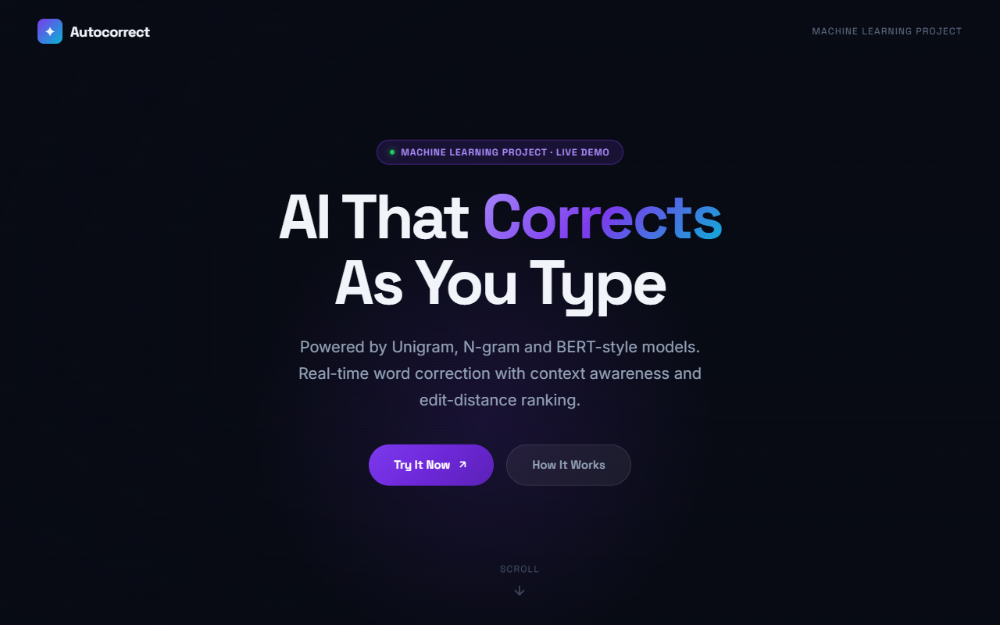
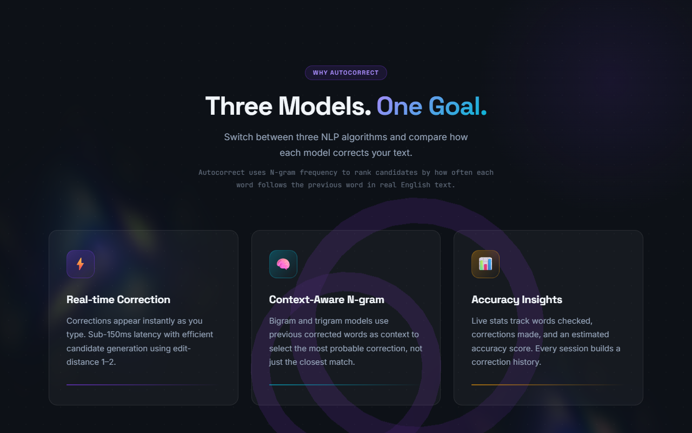
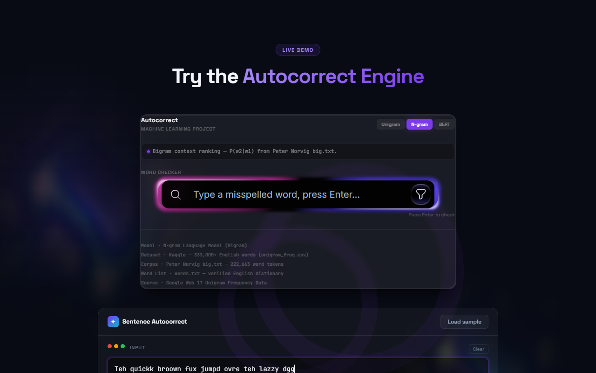

# Autocorrect AI

A production quality AI autocorrect system using Unigram, N gram, and BERT style models. Real time word correction with context awareness.

## Live Demo
Check out the live deployment here: [Autocorrect AI](https://autocorrect-ai.vercel.app)

## Features
* Real time typo correction
* Context aware suggestions
* Beautiful modern UI with Spline 3D integrations

## Visual Documentation

### Hero Section
The landing page featuring a 3D Spline scene and animated typography.

### Key Features
Detailed overview of the machine learning models powering the autocorrect engine.

### Interactive Demo
Type naturally and watch the AI correct your spelling in real time. For example, if you type "Teh quickk broown fux jumpd ovre teh lazzy dgg", the system applies corrections instantly.

## Getting Started

1. Clone the repository
2. Install dependencies with `npm install`
3. Run the development server with `npm run dev`
4. Open http://localhost:3000 in your browser

## Technologies Used
* Next.js
* TypeScript
* Tailwind CSS
* Spline 3D
* Framer Motion
