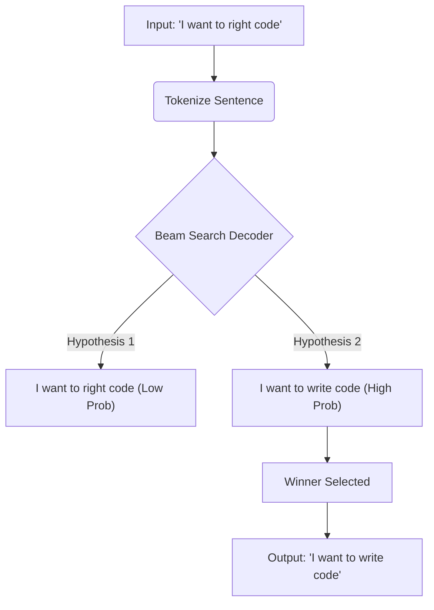

# Autocorrect AI

A production quality AI autocorrect system using Unigram, N gram, and BERT style models. Real time word correction with context awareness.

## Live Demo
Check out the live deployment here: [Autocorrect AI](https://autocorrect-ai.vercel.app)

## Project Architecture

The core of Autocorrect AI revolves around a noisy channel model combined with a sophisticated Language Model and Sentence Beam Search algorithm. The system evaluates not just individual words but the complete contextual span of a sentence to provide accurate corrections.

### 1. Candidate Generation
When an unknown or potentially incorrect word is detected, the candidate generator builds a robust set of potential corrections. The system generates candidates using the following techniques:
*   **Edit Distance:** Generates words within one or two edits (insertions, deletions, substitutions).
*   **Keyboard Proximity:** Considers adjacent keys on a standard QWERTY keyboard (e.g. typing *w* instead of *q*).
*   **Phonetic Matching:** Uses a Soundex based algorithm to cluster words that sound identical despite vastly different spellings.
*   **Repeated Character Compression:** Reduces extended repeated characters (e.g. *pooor* to *poor*).
*   **Confusion Sets:** Identifies homophones and common grammar mistakes (e.g. *there* versus *their*, *affect* versus *effect*).

### 2. The Noisy Channel Score
The system assigns a channel score to each candidate, representing the probability that the user intended to type the candidate word but instead typed the observed word.

```text
Score(Candidate) = -1.35 * EditDistance(Observed, Candidate) 
                   + 1.6 * CharBigramJaccard(Observed, Candidate)
                   + PhoneticBonus 
                   + KeyboardProximityBonus
```

### 3. Contextual N Gram Language Model
To understand the surrounding context, the system calculates an interpolated log probability using unigrams, bigrams, and trigrams. This prevents the model from blindly correcting a word without understanding its grammatical place in the sentence.

```text
InterpolatedLogProb(w3 | w1, w2) = 
    0.52 * log( TrigramProb(w1, w2, w3) ) +
    0.33 * log( BigramProb(w2, w3) ) +
    0.15 * log( UnigramProb(w3) )
```

### 4. Sentence Beam Search Decoding
Instead of acting greedily on a per word basis, Autocorrect AI utilizes a Beam Search decoder. As the system parses a sentence left to right, it maintains the top *N* most probable sentence hypotheses. This allows a later word in the sentence to influence the correction of an earlier word.



### 5. Transformer Reranking (Optional)
For highly ambiguous sentences, an optional Masked Language Model (such as DistilBERT) can be layered on top to rerank the candidates by predicting the probability of the missing word given bidirectional context.

## Visual Documentation

### Hero Section
The landing page featuring a 3D Spline scene and animated typography.


### Key Features
Detailed overview of the machine learning models powering the autocorrect engine.


### Interactive Demo
Type naturally and watch the AI correct your spelling in real time. For example, if you type "Teh quickk broown fux jumpd ovre teh lazzy dgg", the system applies corrections instantly.


## Getting Started

1. Clone the repository
2. Install dependencies with `npm install`
3. Run the development server with `npm run dev`
4. Open http://localhost:3000 in your browser

## Technologies Used
*   Next.js
*   TypeScript
*   Tailwind CSS
*   Spline 3D
*   Framer Motion
*   Python (Jupyter Notebooks for ML Research)
